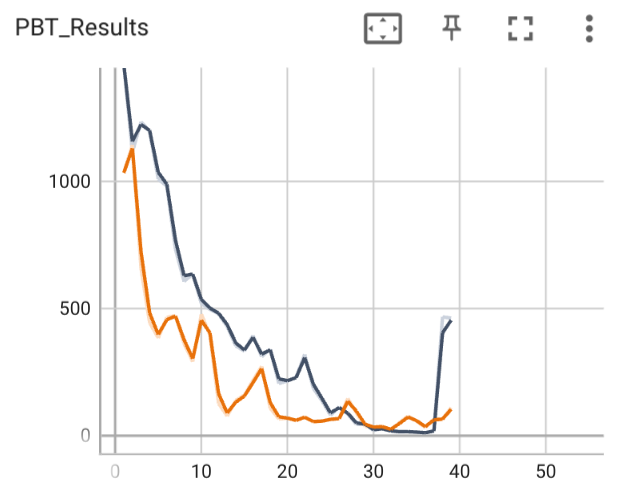
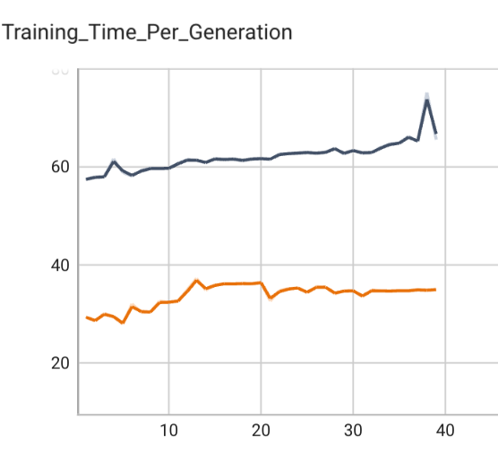
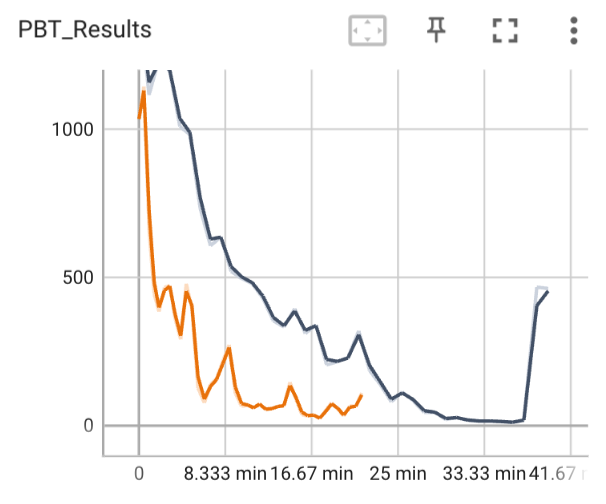

## 背景

这里我们利用我们之前写的 [EVO Population Based Training 算法](https://github.com/yyzpiero/EVO-PopulationBasedTraining) 结合我们自己开发的 [PPO强化学习智能体](https://gitee.com/LordRayleigh/rl-4-cyber-sec) 构建了种群训练的框架。实现了以下的一些功能

- 基于 Population Based Training 的在线调参优化
    - 实现更好的算法表现
- 每一个Agent可以实现多环境**同步**并行
    - 异步并行需要由 Zhejiang Lab 吴建斌实现
    - 更快的运行速度
- 超过Stable-Baselines3的表现
- 更加丰富灵活的功能 （在single-files中已经实现）
    - [ ] Attentions
    - [ ] LSTMs
    - [ ] Coverage
    - [ ] Action Masks 

## 对比Stable-Baselines

> 这里我们使用[nasim-Large环境](https://networkattacksimulator.readthedocs.io/en/latest/reference/scenarios/benchmark_scenarios.html) 对应 **8 子网** **23 节点**

### 参数

| Hyper-Parameters              | Value |
| ----------------------------- | ----- |
| Generations                   | 40    |
| Num Agents                    | 20    |
| Num Envs per Agents           | 16    |
| Training Steps per Generation | 50000 |

### 训练表现

这里黑线代表 Stable-Baseline3，总体来看使用我们的智能体算法表现更好，有着更好的 Sample-efficiency

### 训练时间

对比每一代的训练时间，使用我们的智能体算法可以大概快80%-100%。 同时随着训练的进行，每一子代中神经网络参数更新次数更多，所以训练用时更长。

同时我们也看到随绝对训练时长，不同智能体算法的训练表现

## 后续想法

1. 我们想目前可以 提前探讨一下 对于国产平台的优化加速
    - 希望各位老师帮忙介绍一下9A体系结构的特点   
2. 智能体也做了 简略的系统拆分 （算法部分 以及 储存部分）
    - 可以做进一步的优化
3. 也期待后面 引入异步并行后 更好的性能表现
4. 讨论下对于更复杂的网络结构的优化（e.g. Attention，LSTM, etc ）

